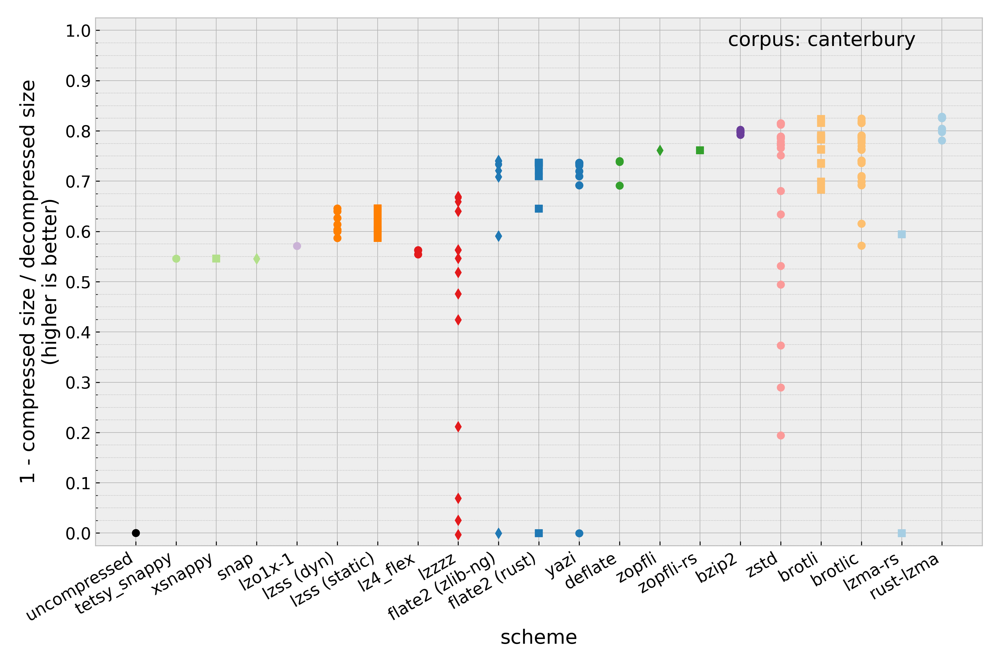
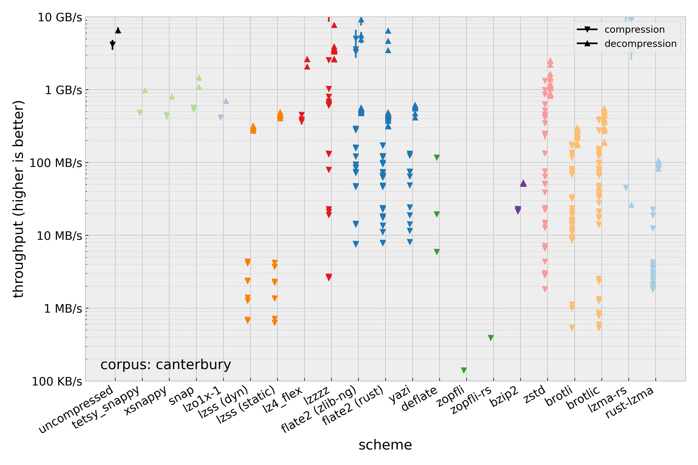
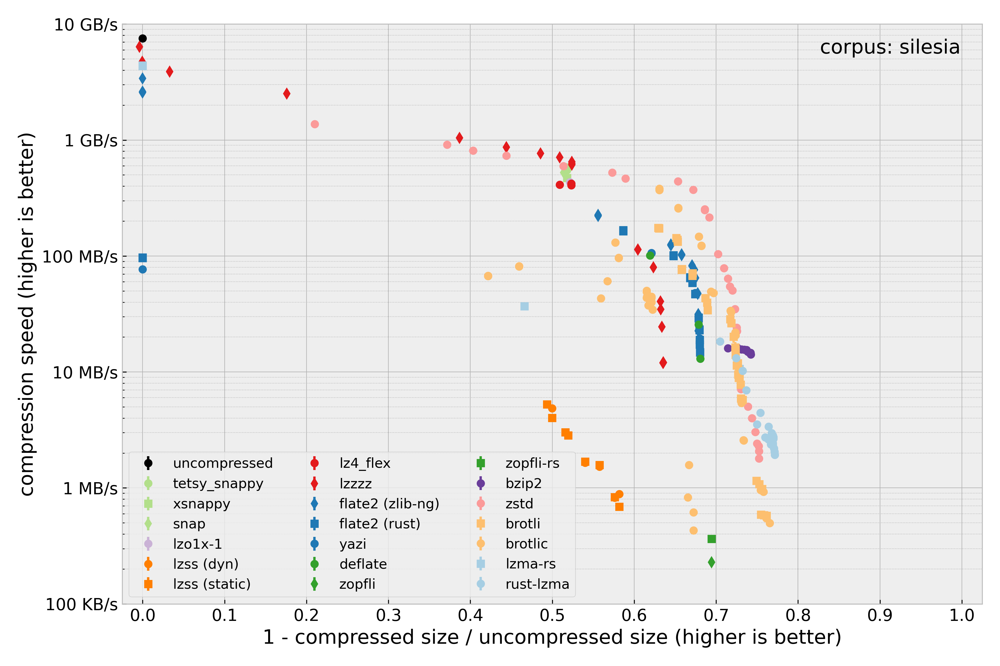
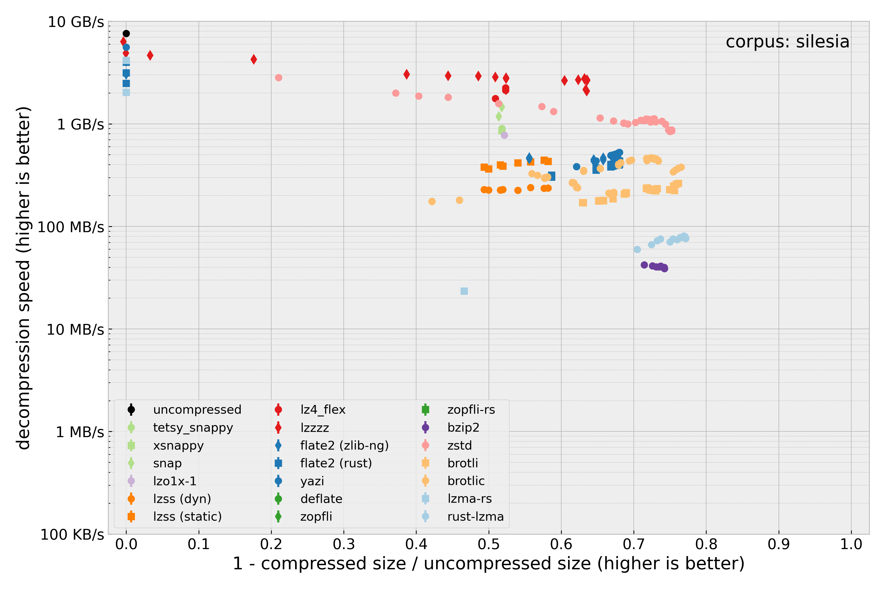

Comparison of compression crates available for Rust
===================================================

Procedure
---------

I compress three different corpora using various compression methods available as Rust crates.
Only lossless general-purpose compression algorithms are considered.
Where available, bulk compression/decompression APIs are used rather than streaming APIs.
Executable code size and use of main memory (internal buffers etc.) is not considered.
Details on the corpora and the choice of compression schemes can be found below.

The test was automated (except for the figures), the source code can be found in this repository.
A rough overview of the test procedure follows.

- For each compression algorithm:
  - For each corpus:
    - Load all files from the file system
    - Concatenate the files into a single array
      - For each compression setting:
        - Repeat 10 times:
          - compress the array (allocating a new vector) and record the time required
          - record the size of the decompressed data
          - preallocate a buffer for the decompressed data
          - decompress the data to this buffer and record the time required
          - verify that the roundtripped data equals the original data
        - Combine the results and record average and empirical standard deviation

The source code is laid out as follows.
The directory `common` contains a library crate with common functionality: Reading the corpora, `Compress` and `Decompress` traits as a common abstraction for all schemes, recording runtime, and statistical summary of the results.
The directory `schemes` contains a binary crate for each of the compression schemes.
Each of those crates can be run with `cargo run --release` to perform the test for that scheme.
The output is a headerless csv with the following columns in order: scheme name, compression settings, corpus, average compression speed (MB/s), empirical standard deviation of compression speed (MB/s), average decompression speed (MB/s), empirical standard deviation of decompression speed (MB/s), compression ratio.
The folder `schemes` also contains a simple shell script that runs each benchmark.

Summary of results
------------------

For raw data, see [`results.csv`](./results.csv) (this CSV includes a header line).
Note: speed of compression and decompression is always measured by the throughput of _uncompressed_ data.
For additional plots not shown here, see the [plots](./plots) directory.

Generally, all schemes compress the canterbury corpus (2.8 MB) best in terms of both size and throughput (i.e. compression & decompression speed), followed by the "large" canterbury corpus (11 MB), followed by the Silesia corpus (212 MB).

Note that compression and decompression speed are depicted with error bars (depicting the square root of the sample variance) but they are almost always smaller than the markers.

The smallest compressed sizes (of the Silesia corpus) are achieved, by:

- the lzma group
- the brotli group
- zstd
- bzip2
- zopfli
- Other DEFLATE encoders
- LZ4 (C bindings)
- LZSS
- LZ4 (Rust)
- lzox1-1
- snappy implementations

(Order is from best to worst.)

The following graphics depict the throughput (compression and decompression speed) of each scheme and all tested settings against the achieved size reduction (i.e. quality of the compression) for the Silesia corpus.
For the smaller corpora, the shape is roughly the same when accounting for the previously stated fact that they are generally compressed better in all metrics.

At the highest range of compression (smallest compressed sizes, >70% size reduction), there are four contenders: rust-lzma, brotli/brotlic (which have similar overall performance), bzip2, and zstd.
rust-lzma achieves the best compression and, at a given speed, generally compresses faster than zstd and brotli.
brotli decompresses faster than rust-lzma and zstd decompresses faster than brotli.
zstd compresses about as fast or faster than brotli but doesn't quite reach the same top size reduction.
bzip2 compresses faster than rust-lzma but has the slowest decompression speed.

In the upper middle range (50% to 70% size reduction), zstd compresses faster than anything else.
It also decompresses faster than most other algorithms except lzzzz, which has the fastest decompression speed in its entire range of supported compression qualities.
In this range, brotlic performs similarly to most DEFLATE implementations, but brotli can also achieve smaller file sizes (at reduced throughput).
brotli (the Rust implementation) has slower decompression speed than the DEFLATE decoders.
zopfli and zopfli-rs achieve marginally better compression than the other DEFLATE encoders but have absolutely terrible compression throughput.
lzss has very low compression speed and can't achieve very high size reduction, but it decompresses at a similar rate as the DEFLATE decoders.
The variants with compile-time parameters are only faster than the one with run-time parameters when decompressing, not when compressing.

In the mid-range (~50% size reduction), the snappy implementations, lz4\_flex, and lzo1x-1 have similar compressed sizes and compression speed.
lz4\_flex has a much higher decompression speed.

For worse compression quality (bigger compressed sizes), lzzzz achieves the fastest compression and decompression speed.
zstd has similar compression speed, but decompression is slower by a varying factor of up to ~2.

Recommendations
---------------

Use zstd.
At compression level 5 zstd compresses at ~100 MB/s and decompresses at ~1 GB/s while reducing file size by 70-75%.
It doesn't achieve the best size reduction or the fastest throughput overall, but it's competitive for a wide range of speed/size tradeoffs.
It also supports pre-training dictionaries to achieve better compression and throughput for many instances of small similar data (though this is not tested here).

If you need the smallest compressed size with no regard for speed, use rust-lzma at the highest compression settings.
Be aware however that the file size reduction is only a little better than zstd while decompression takes an order of magnitude longer.

If you need something in pure Rust with no FFI, use either lz4\_flex or yazi.
lz4\_flex decompresses extremely fast (2+ GB/s), compresses only slightly slower (350 MB/s) than the fastest Rust compressor overall and achieves a middling size reduction (50-55% depending on corpus).
yazi achieves significantly better compression (70-75%) at the cost of disproportionately lower throughput.

If you have requirements which haven't been considered here or a particular kind of data, do your own research. 🙂

Compression schemes
-------------------

Unless noted otherwise, all compression schemes are used with default features.
Settings are mostly combinations of parameters that get special mention in the documentation.
For example, brotli allows setting a block buffer size, but doesn't make note of valid or suggested values, so I only used the setting `4096` (which appears in the documentation).
As another example, flate2 documents that valid compression levels are 0-9 inclusive, and the entire range is tested.

Note that some compression algorithms (e.g. zstd) have provisions for compressing many instances of small but similar data.
These algorithms may (or may not) perform much better on the canterbury corpus and smaller data than it appears here.

The automated benchmarks were compiled using stable Rust 1.69 (2023-04-20) in release mode (no custom settings).
Compression and decompression were performed sequentially.
Benchmarks were run sequentially.

There are a few groups of compression schemes/crates:

- uncompressed:
  "compression" via `.to_vec()`, "decompression" via `.copy_from_slice()`.
  Serves as a baseline comparison.
- DEFLATE:
  - [flate2](https://docs.rs/flate2/latest/flate2/):
    Common API for various deflate/zlib/gzip encoders/decoders.
    The [miniz\_oxide](https://docs.rs/miniz_oxide/latest/miniz_oxide/) (a pure Rust implementation) and `zlib-ng` backends are tested.
    Does not support `no_std`, but `miniz_oxide` does.
    Settings are: format (deflate/zlib/gzip) and compression level (0 to 10 inclusive, 0 being no compression, 10 being high/slow compression).
  - [yazi](https://docs.rs/yazi/0.1.6/yazi/):
    Rust implementation of DEFLATE.
    Does not require heap allocation (but does require std).
    Only raw format is tested (zlib is also supported).
    Compression levels: none, best speed, default, best size, and specific levels (1 to 10 inclusive).
    It also supports different compression strategies, but only the default is tested.
- DEFLATE compressors (no decompression):
  - [deflate](https://docs.rs/deflate/1.0.0/deflate/)
    Safe Rust implementation of DEFLATE compression, optionally in zlib/gzip formats.
    "In maintenance mode".
    "fast", "high", and default compression options are tested, but there are more tunable parameters.
  - [zopfli](https://docs.rs/zopfli/0.7.2/zopfli/):
    Rust reimplementation of zopfli.
    The settings recommended for big files is tested (iteration count = 5, maximum block splits = 15).
  - [zopfli-rs](https://docs.rs/zopfli-rs/0.1.1/zopfli_rs/):
    Rust bindings to zopfli.
    A dependency contains code that will be rejected by a future version of Rust.
    Tested with the same settings as the rust implementation.
    I wouldn't include this but I make an exception because it's interesting to compare the performance between the C and Rust versions.
- lz4:
  - [lzzzz](https://docs.rs/lzzzz/1.0.4/lzzzz/):
    Rust bindings to liblz4.
    The block format is tested in normal and high compression mode at several acceleration factors ranging from 0 to 65535.
    For the frame format, default, high, and max settings are tested.
  - [lz4\_flex](https://docs.rs/lz4_flex/0.10.0/lz4_flex/):
    Rust lz4 compression.
    No tunable parameters.
    Safe by default, unsafe optimizations available (block format only) - all combinations are tested.
    Supports `no_std` (block format only).
- lzma:
  - [rust-lzma](https://docs.rs/rust-lzma/latest/lzma/):
    Rust bindings to liblzma (implements XZ compression).
    Compression levels 0 to 9 (inclusive) in a "normal" and an EXTREME variant are tested.
  - [lzma-rs](https://docs.rs/lzma-rs/0.3.0/lzma_rs/):
    Rust implementation of lzma/lzma2/xz formats.
    Compression is implemented but only the lzma compresser actually attempts compression.
    No tunable parameters.
- snappy:
  - [tetsy\_snappy](https://docs.rs/tetsy-snappy/0.1.0/tetsy_snappy/):
    Rust bindings to the snappy compression library.
    No tunable parameters.
  - [snap](https://docs.rs/snap/1.1.0/snap/):
    Rust implementation of snappy.
    No tunable parameters.
  - [xsnappy](https://docs.rs/xsnappy/0.1.0/xsnappy/):
    Rust implementation of snappy.
    No tunable parameters.
- brotli:
  - [brotlic](https://docs.rs/brotlic/0.8.1/brotlic/):
    Rust bindings to the brotli library.
    Has a billion tunable parameters.
    I test quality levels 0 to 11 (inclusive), window sizes 20 to 22 (inclusive) and a buffer size of 4096.
    All other parameters are defaults.
  - [brotli](https://docs.rs/brotli/latest/brotli/):
    Rust port of brotli.
    Has `no_std` Support.
    The documentation is bad, but I make an exception because it's popular.
    Same settings as for the bindings.
- [zstd](https://docs.rs/zstd/0.12.3+zstd.1.5.2/zstd/):
  Rust bindings to `libzstd`.
  The full range of positive quality levels from 0 to 22 (inclusive) are tested, as well as a few negative (fast) quality levels down to -50 are tested.
- [lzo1x-1](https://docs.rs/lzo1x-1/0.1.0/lzo1x_1/):
  Port of LZO1X-1 (a variant of LZO used in the Linux kernel) to safe Rust.
  Seems to supports `no_std`?
  No tunable parameters.
- [lzss](https://docs.rs/lzss/latest/lzss/index.html):
  Rust implementation of LZSS.
  Supports `no_std`.
  Intended for embedded systems, claims small code size and little RAM/CPU use.
  Both dynamic (runtime parameters) and generic (compile-time parameters) are tested.
  Parameters are the number of bits in the offset (range 10 to 13 inclusive is tested), the number of bits in the length (4 and 5 bits are tested), and the initial fill byte of the compression buffer (0x20).
- [bzip2](https://docs.rs/bzip2/0.4.4/bzip2/):
  Rust bindings to bzip2
  Compression levels 1 to 10 (inclusive) are tested.

Excluded schemes
----------------

The following compression schemes / crates are categorically excluded:

- archive formats, e.g. zip, 7z
- lossy schemes, e.g. bloom filters
- schemes tailored to specific content types, e.g. PNG, FLAC
- schemes based solely run-length encoding (since it's outperformed by anything else in the general case)
- crates which have no/bad documentation
- crates that appear to be written by like one person just for fun

I have purposefully excluded the following schemes from consideration (again, in no particular order):

- [rust\_lzo](https://docs.rs/rust-lzo/latest/rust_lzo/): LZO algorithm, automatically translated to Rust from C source
- [lz4](https://docs.rs/lz4/1.24.0/lz4/): liblz4 binding less ergonomic than lzzzz.
- [lz4\_compression](https://docs.rs/lz4-compression/0.7.0/lz4_compression/): lz4 in unsafe Rust. "Only [...] passively maintained" and not recommended over lz4_fear.
- [lz4\_compress](https://docs.rs/lz4-compress/0.1.1/lz4_compress/): unmaintained and likely superseded by `lz4_compression`.
- [lz-fear](https://docs.rs/lz-fear/0.1.1/lz_fear/): Safe Rust lz4 compression. Last update is 3 years old at time of writing. I couldn't figure out how to use this.
- [banzai](https://docs.rs/banzai/0.3.1/banzai/): bzip2 encoder written in safe Rust. Alpha stage, no decoder.
- [flate3](https://docs.rs/flate3/0.1.21/flate3/): I couldn't find a source repository.
- [gzip](https://docs.rs/gzip/0.1.2/gzip/): I couldn't find a source repository.
- [lzma](https://docs.rs/rust-lzma/latest/lzma://docs.rs/lzma/0.2.2/lzma/): Rust bindings to liblzma. Project may or may not be dead.
- [snappy](https://docs.rs/snappy/0.4.0/snappy/): Bindings to the snappy library. Limited API.
- [bzip2-rs](https://docs.rs/bzip2-rs/0.1.2/bzip2_rs/): Safe Rust bzip2 decompressor - no compressor available.
- [redux](https://docs.rs/redux/0.2.0/redux/): Adaptive arithmetic compression in Rust - seems too low-level for general use.
- [compress](https://docs.rs/compress/0.2.1/compress/): Decompression (not compression) for various algorithms in Rust. Proof of concept, not production-quality, no activity in 3 years.
- [lzokay](https://docs.rs/lzokay/1.0.1/lzokay/): Rust bindings to lzokay which implements LZO. Has support for `no_std`. Build failed when I tried it.
- [bzip3](https://docs.rs/bzip3/0.5.1/bzip3/): Rust bindings to bzip3. Requires nightly rust (try blocks)
- [lzfse\_rust](https://docs.rs/lzfse_rust/0.2.0/lzfse_rust/): Rust LZFSE implementation. Appears to be made by one person for fun.

There are many more crates which I don't note here, probably many more that I haven't noticed, and some of them may be good.

Corpora
-------

- [Canterbury](https://corpus.canterbury.ac.nz/descriptions/) - total size 2.8 MB
  - alice29.txt: 152 kB English text
  - asyoulik.txt: 125 kB English text
  - cp.html: 25 kB English HTML
  - fields.c: 11 kB C source code
  - grammar.lsp: 4 kB LISP source code
  - kennedy.xls: 1.0 MB Excel spreadsheet
  - lcet10.txt: 427 kB English text
  - plrabn12.txt: 482 kB English text
  - ptt5: 513 kB, I'll be honest I don't know what this is
  - sum: 38 kB SPARC executable
  - xargs.1: 4 kB English ROFF
- [Canterbury large](https://corpus.canterbury.ac.nz/descriptions/) - total size 11 MB
  - E.coli: 4.6 MB genome of E.coli
  - bible.txt: 4.0 MB English text
  - world192.txt: 2.5 MB English text
- [Silesia](https://sun.aei.polsl.pl/~sdeor/index.php?page=silesia) - total size 212 MB
  - dickens: 10 MB English text
  - mozilla: 51 MB release tar (Mozilla project)
  - mr: 10 MB image
  - nci: 33 MB database of chemical structures
  - ooffice: 6 MB windows dll
  - osdb: 10 MB MySQL database
  - reymont: 6 MB Polish PDF
  - samba: 21 MB source code tar (Samba project)
  - sao: 7 MB star catalog
  - webster: 41 MB English dictionary
  - xml: 5 MB tar of XML files
  - x-ray: 8 MB image

If you want to run the comparison yourself, you can download the corpora at the above URLs.
To set up the file structure used by the test runner, place the archived corpora, `cantrbry.tar.gz`, `large.tar.gz`, and `silesia.zip` at the root of the project folder and run `setup-corpora.sh`.
This should unpack the data to the `corpora` subdirectory.
You can delete the archives afterwards.

Test hardware
-------------

- PC workstation from 2018
- CPU: AMD Ryzen 7 2700X
- OS: Archlinux with standard kernel, up to date at time of testing (May 2023)
- RAM: 2 times 8 GiB DDR4, 1467 MT/s
